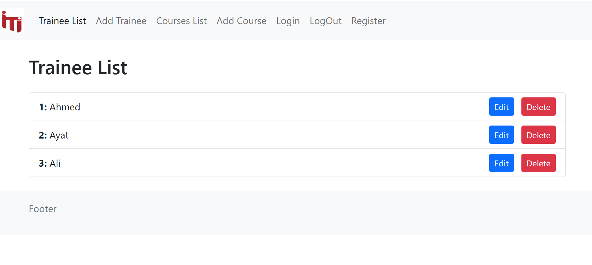
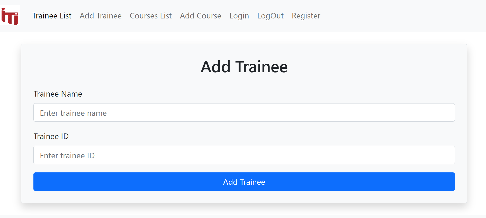
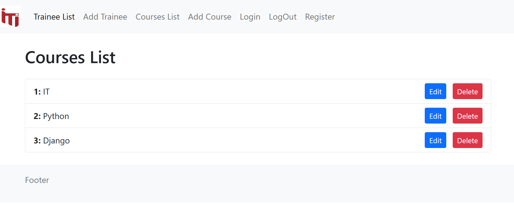

# ITlan Project

## Project Overview
ITlan is a Django-based web application that manages trainees and courses. The project consists of multiple apps, including a **trainee management system** and a **course management system**, as well as authentication functionalities.





## Project Structure
```
ITlan/
│── ITlan/               # Main Django project
│   │── settings.py      # Project settings
│   │── urls.py          # Root URL configuration
│   │── wsgi.py          # WSGI entry point
│   │── asgi.py          # ASGI entry point
│
│── trainee/             # Trainee management app
│   │── views.py         # View functions for trainees
│   │── urls.py          # URL routing for trainees
│   │── templates/       # HTML templates for trainees
│
│── course/              # Course management app
│   │── views.py         # View functions for courses
│   │── urls.py          # URL routing for courses
│   │── templates/       # HTML templates for courses
│
│── templates/           # Shared templates
│   │── base.html        # Base template with navbar and footer
│
│── static/              # Static assets 
│
│── db.sqlite3           # SQLite database
│── manage.py            # Django management script
│── README.md            # Project documentation
```

## Features
### Trainee Management
- `traineeList`: Displays a table of trainees.
- `addTrainee`: Form to add a new trainee (POST request).
- `updateTrainee`: Updates a trainee and redirects to the trainee list.
- `deleteTrainee`: Deletes a trainee and redirects to the trainee list.

### Course Management
- `courseList`: Displays a table of courses.
- `addCourse`: Form to add a new course.
- `updateCourse`: Updates a course and redirects to the course list.
- `deleteCourse`: Deletes a course and redirects to the course list.

### Authentication
- `login`: User login.
- `logout`: User logout.
- `registration`: User registration.

## Navigation Links
The base template (`base.html`) includes a navbar with links to:
- Trainee List
- Add Trainee
- Course List
- Add Course

## Setup Instructions
1. Clone the repository:
   ```sh
   git clone https://github.com/Ayat166/Django-Day1.git
   ```
2. Navigate to the project directory:
   ```sh
   cd ITlan
   ```
3. Create a virtual environment and activate it:
   ```sh
   python -m venv env
   source env/bin/activate  # On Windows use `env\Scripts\activate`
   ```
4. Install dependencies:
   ```sh
   pip install -r requirements.txt
   ```
5. Run the development server:
   ```sh
   python manage.py runserver
   ```
7. Open the browser and visit:
   ```
   http://127.0.0.1:8000/
   ```